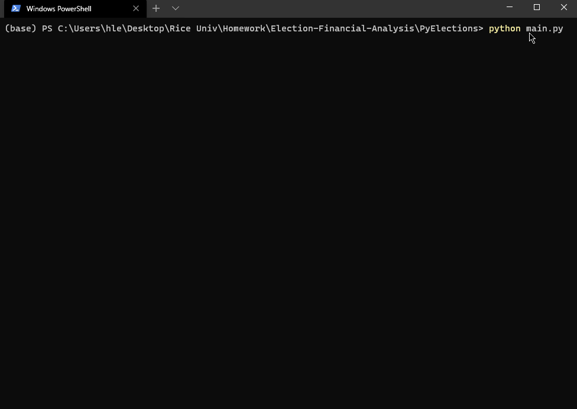

# First Glance at Python Powerhouse
## 1. Background
No doubt, MS Excel is an excellent tool. Yet, when dealing with large dataset, Python is a more optimal choice. In this project, Python (no other libraries except CSV to read files & OS for joining path) is utilized for processing and analyzing two datasets: Mayoral Election & Company Financial Data. Reports of each process are exported into a text file `.txt`.

A quick glance at the final Election Analysis run in Windows Terminal - PowerShell:

    

## 2. Languages, Tools & Techniques
* **Languages:**
    * Python | Shell Scripts
* Modules:
    * CSV | OS
* **Software/ Applications:**
    * Visual Studio Code | Jupyter Notebook (JPNB) | Notepad++ | Windows Terminal | GitBash | Google Chrome
* **Operating System:**
    * Windows 10 ver. 1909
## 3. Table of Contents
* **Images:** screen captured (.gif) demo of programs run in PowerShell.
* **PyElections:** folder contains files and analysis of Mayoral Election Data:
    * **Jupyter Notebook:** used during the development of final `main.py`.
    * **Resources:** raw election data.
    * **Election_Results.txt:** exported report after running analysis.
    * **main.py:** final program (converted from JPNB) that can be run in Windows Terminal.
* **PyFinances:** folder contains files and analysis of Company Financial Data:
    * **Jupyter Notebook:** used during the development of final `main.py`.
    * **Resources:** raw financial data.
    * **Budget_Report.txt:** exported report after running analysis.
    * **main.py:** final program (converted from JPNB) that can be run in Windows Terminal.
## 4. Topics
Both Python programs were developed to summarize data:
#### 4.1 PyElections
* Total number of votes.
* List of all candidates.
* Total votes casted for each candidate.
* Percentage of votes casted for each candidate.
* Names of 1st and 2nd candidates.

#### 4.2 PyFinances
*  Total number of months included in the dataset.
*  Net total amount of "Profit/Losses" over the entire period.
*  Average changes in "Profit/Losses" over the entire period.
*  Greatest increase in profits (date and amount) over the entire period.
*  Greatest decrease in losses (date and amount) over the entire period.

## 5. Highlights of Key Process
* File Handler with `with open()`.
* Loop thru all CSV rows and extract data with `for` loop.
* Append data to Lists with `list.append()`.
* Numerical dtype transformation: `round()`, `sum()`, `int()`, etc.
* Perform simple math do add, or subtract data.
* Write output to _.txt_ file with `.write()`.

## 6. How to Use
* This repository contains all source codes and data needed for replications. If desired, a new dataset with similar structure can be used. If column order changes, modify the `row_data[<index>]` to point to correct columns.
* `git clone https://github.com/henryle-n/Election-Financial-Analysis.git`
